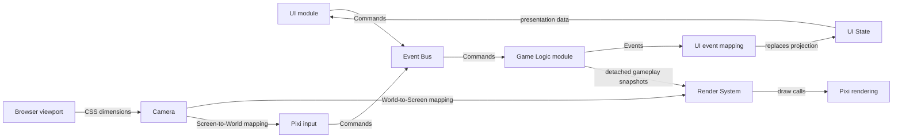

# Architecture

Bootstrap communication and rendering are implemented. Match-3 remains a shell. [Stack](../tech/stack.md) · [Workspace layout](../../README.md#workspace-layout).

Games and prototypes are independent composition roots. Shared packages do not import applications. Core and logger remain presentation-independent; Game Logic does not import UI or rendering. The dependency check enforces these import restrictions. No reusable gameplay framework is implemented.

Game Logic owns gameplay state. UI State is a read model. Mutable ECS storage stays private. Composition roots inject Command delivery, Event publication, state readers, and scene mounting; library primitives remain ordinary imports. Modules use closures with compact APIs.

Bootstrap Commands and Events are delivered synchronously, in subscription order. Game Logic commits before publishing an Event; Pixi reads committed state on each frame. Subscriber errors propagate to the sender.

## Camera

The World operates in its own coordinates, independently of the browser. The renderer owns the Camera, which maps between World Coordinates and Screen Coordinates.

The initial policy fixes visible World Width at 100 units and adapts visible height to the viewport. The origin is top-left; positive x points right and positive y points down. Screen Coordinates are canvas-local CSS pixels. Both axes use the same scale; device pixel ratio affects the backing buffer only. Resizing never changes gameplay state.

Camera accepts an optional empty `CameraConfig` object as an extension point. No configuration settings, panning, or zoom are supported yet.

## Open questions

- Which future Camera settings should be supported?
